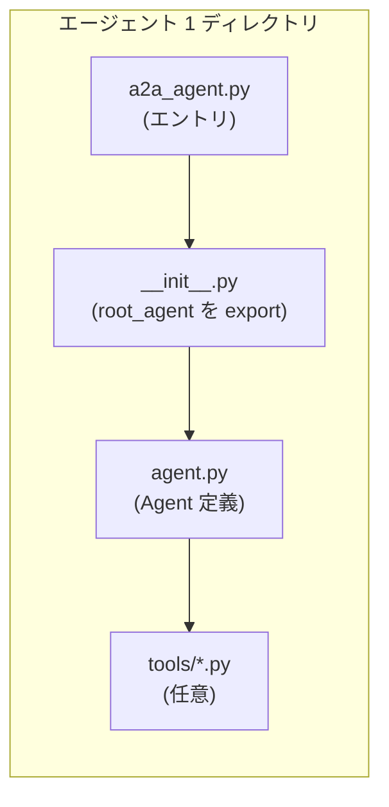
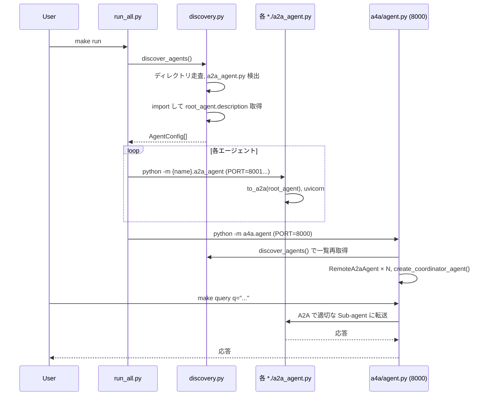

# エージェント作成時のファイル間連携

シニアバックエンドエンジニア向けに、**エージェントを1つ作る際のファイル構成**と**コア（a4a）との連携**を図で整理する。

---

## 1. 単一エージェント内のファイル連携

1つのエージェント（例: `okinawa_beach_recommender`）を作る場合の、**必須ファイル**と**参照関係**は次のとおり。

```
┌─────────────────────────────────────────────────────────────────────────────┐
│  エージェントディレクトリ（例: okinawa_beach_recommender / palm_tree_info_agent）  │
└─────────────────────────────────────────────────────────────────────────────┘

  ┌──────────────────┐
  │  __init__.py     │  パッケージの入口。discovery が import する
  │  root_agent を   │◄────────────────────────────────────────────┐
  │  export          │                                             │
  └────────┬─────────┘                                             │
           │ from .agent import root_agent                         │
           ▼                                                       │
  ┌──────────────────┐     ┌─────────────────────────────────────┐│
  │  agent.py        │     │  tools/ （任意）                      ││
  │                  │     │  ┌───────────────────────────────┐  ││
  │  - name          │     │  │ recommend_okinawa_beaches_tool │  ││
  │  - description   │◄────┼──│ get_animal_sound_info_tool     │  ││
  │  - instruction   │     │  │ get_okinawa_soba_recipe_tool   │  ││
  │  - model         │     │  │ ...                             │  ││
  │  - tools=[...]   │─────┼─►└───────────────────────────────┘  ││
  │                  │     └─────────────────────────────────────┘│
  │  root_agent =    │                                             │
  │  Agent(...)     │                                             │
  └────────┬─────────┘                                             │
           │ root_agent を定義                                      │
           ▼                                                       │
  ┌──────────────────┐                                             │
  │  a2a_agent.py    │  エントリポイント。run_all が -m で起動する      │
  │                  │                                             │
  │  from . import   │─────────────────────────────────────────────┘
  │    root_agent    │  （. は __init__.py 経由で root_agent を取得）
  │  a2a_app =       │
  │    to_a2a(       │
  │      root_agent, │
  │      port=PORT   │
  │    )             │
  │  uvicorn.run()   │
  └──────────────────┘
```

**ポイント**

| ファイル | 役割 |
|----------|------|
| `__init__.py` | `root_agent` を公開。discovery が `import {agent_name}` で description 取得時に利用。 |
| `agent.py` | ADK の `Agent` を定義（name, description, instruction, tools）。**実装の中心**。 |
| `tools/*.py` | （任意）Agent に渡すツール。agent.py で import し `tools=[...]` に列挙。 |
| `a2a_agent.py` | `root_agent` を `to_a2a()` で A2A サーバ化し、uvicorn で起動。**発見条件**: このファイルが存在するディレクトリが「エージェント」とみなされる。 |

---

## 2. コア（a4a）とエージェントの連携 — 起動・発見・実行

全体の流れは次のとおり。

```
┌─────────────────────────────────────────────────────────────────────────────────┐
│  ユーザー操作: make run  （= python -m a4a.run_all）                                │
└─────────────────────────────────────────────────────────────────────────────────┘
                                        │
                                        ▼
  ┌─────────────────────────────────────────────────────────────────────────────┐  │
  │  a4a/run_all.py                                                             │  │
  │  ─────────────                                                              │  │
  │  1. discover_agents() を呼ぶ                                                │  │
  │  2. 各 AgentConfig に対して subprocess: python -m {module}  (module = *.a2a_agent) │  │
  │     → 例: python -m okinawa_beach_recommender.a2a_agent  (PORT=8001...)      │  │
  │  3. 最後に python -m a4a.agent  (PORT=8000) で Coordinator を起動             │  │
  └─────────────────────────────────────────────────────────────────────────────┘
                    │                                    │
                    │ discover_agents()                  │
                    ▼                                    │
  ┌─────────────────────────────────────┐               │
  │  a4a/discovery.py                   │               │
  │  ─────────────────                  │               │
  │  • ルート直下の「ディレクトリ」を走査  │               │
  │  • 各 dir に a2a_agent.py があるか確認 │               │
  │  • あれば import {dir名} して         │               │
  │    root_agent.description を取得     │               │
  │  • AgentConfig(name, module, port,   │               │
  │    url, description) を返す          │               │
  └─────────────────────────────────────┘               │
                    │                                    │
                    │ AgentConfig[]                      │
                    ▼                                    ▼
  ┌─────────────────────────────────────────────────────────────────────────────┐  │
  │  各エージェント (8001, 8002, ...)              │  a4a/agent.py (Coordinator 8000)  │  │
  │  ─────────────────────────────────           │  ─────────────────────────────   │  │
  │  • a2a_agent.py が to_a2a(root_agent) で      │  • load_remote_agents()           │  │
  │    FastAPI アプリを起動                        │    → discover_agents() で一覧取得  │  │
  │  • /.well-known/agent-card.json を公開        │  • 各 config から RemoteA2aAgent   │  │
  │  • A2A プロトコルでリクエスト受付              │    を生成 (agent_card=url)        │  │
  │                                               │  • create_coordinator_agent()     │  │
  │                                               │    sub_agents=remote_agents       │  │
  │                                               │  • to_a2a(coordinator) で 8000 で  │  │
  │                                               │    公開                            │  │
  └─────────────────────────────────────────────────────────────────────────────┘  │
                    ▲                                    │
                    │ A2A 呼び出し                        │ ユーザー問い合わせ
                    │ (Coordinator が Sub-agent に転送)   ▼
                    │                            ┌───────────────┐
                    └────────────────────────────│  make query   │
                                                 │  (8000 に送信) │
                                                 └───────────────┘
```

**まとめ**

- **発見**: `discovery.py` が「`a2a_agent.py` があるディレクトリ」をエージェントとみなし、`__init__.py` の `root_agent.description` を読む。
- **起動**: `run_all.py` が discovery の結果に従い、各 `{name}.a2a_agent` をサブプロセスで起動し、最後に `a4a.agent`（Coordinator）を起動する。
- **連携**: Coordinator（`a4a/agent.py`）は同じ discovery で取得した AgentConfig から `RemoteA2aAgent` を組み、sub_agents として持つ。ユーザーは 8000 に話しかけ、Coordinator が 8001 以降のエージェントに A2A で転送する。

---

## 3. エージェントを「1つ追加する」ときに触るファイル（チェックリスト）

| やること | ファイル／場所 |
|----------|-------------------------------|
| エージェント用ディレクトリを用意 | ルート直下に `my_agent/` など |
| パッケージとして認識させる | `my_agent/__init__.py` で `from .agent import root_agent` と export |
| エージェント実体を定義 | `my_agent/agent.py` で `Agent(name, description, instruction, tools=[...])` と `root_agent` を定義 |
| （必要なら）ツールを追加 | `my_agent/tools/*.py` を実装し、`agent.py` の `tools=[...]` に追加 |
| A2A サーバとして起動可能にする | `my_agent/a2a_agent.py` で `to_a2a(root_agent, port=PORT)` と uvicorn 起動 |

**discovery の条件**: そのディレクトリに `a2a_agent.py` が存在すること。  
追加後は `make run` で自動検出され、Coordinator から利用される。

---

## 4. 図（Mermaid）— 単一エージェントの依存関係



## 5. 図（Mermaid）— 起動・発見・Coordinator との関係



---

以上が、エージェント作成時のファイル間連携の整理です。
