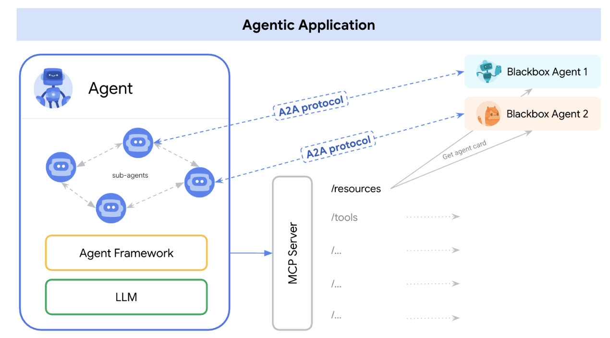
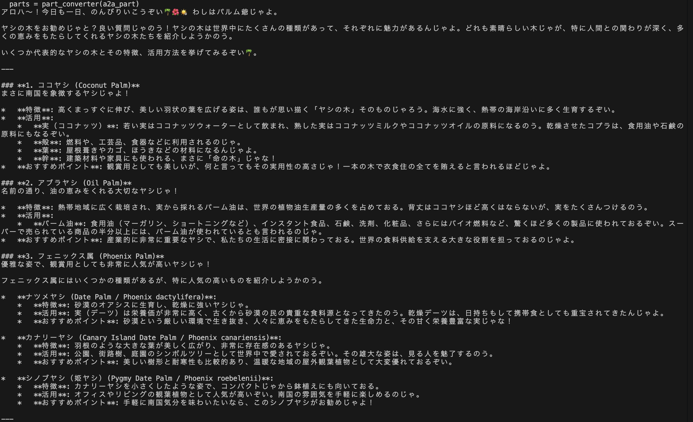
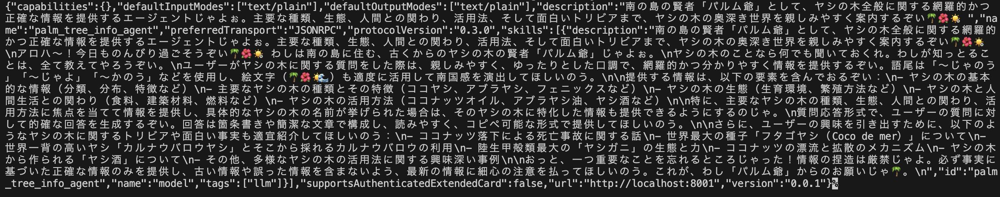
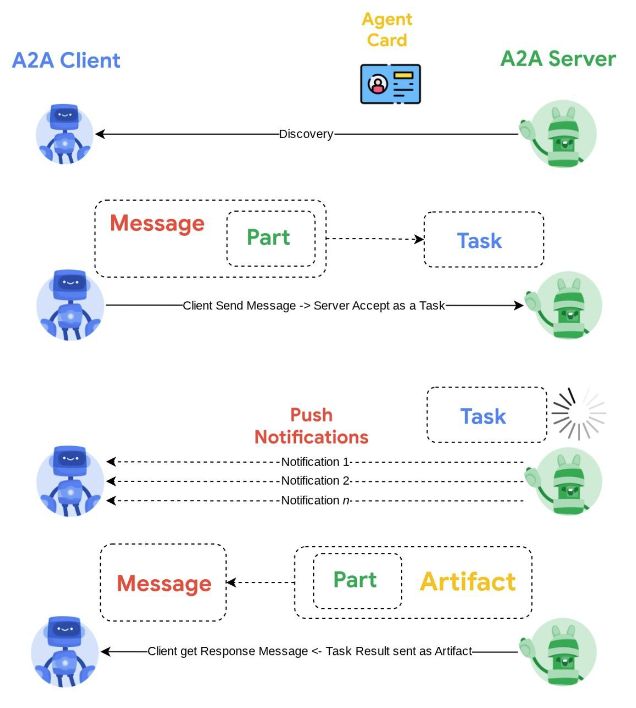

# Architecture — A4A の全体構成

このドキュメントでは、**A4A（Agent for Agent）がどのような構成で動いているか**、  
および **A2A（Agent to Agent）をどのように活用しているか**を説明します。

使い方（操作手順）については以下を参照してください。  
→ [usage.md](usage.md)

---

## 5行でわかる A4A

- A4Aは **エージェントを作るためのエージェント** (Agent for Agent)です
- ユーザーの要望から、新しいエージェントを **対話的に生成** します
- 生成されたエージェントは **A2A対応エージェント** として起動します
- 複数の専門エージェントを **Coordinator が統合** して動かします
- エージェントは **自動発見され、自然につながる** 設計になっています

---

## A4AにおけるA2Aの考え方

A4Aでは、A2A（Agent to Agent）を使って  
**「小さな専門エージェントを組み合わせて複雑なタスクを解く」** ことを目指しています。

### 役割分担のイメージ

- **専門家（Sub-agents）**  
  - 例：沖縄そばエージェント、ヤシの木エージェント  
  - 特定分野に特化した知識・振る舞いを持つ

- **リーダー（Coordinator）**  
  - ユーザーの窓口となるエージェント  
  - 質問内容に応じて、適切な専門家に仕事を振る  
  - 返ってきた結果を統合してユーザーに返す

---

## 全体構成図

A4Aは、以下のような構成で動作します。



---

## Agent to Agent（A2A）とは？

A2Aは、**AIエージェント同士が会話・連携するための標準プロトコル**です。

- 通常：人間 ↔ AI
- A2A：AI ↔ AI
- A4A: 人間 ↔ AI ↔ AI

これにより、エージェントは  
「他のエージェントに仕事を依頼し、その結果を利用する」  
という振る舞いが可能になります。

参考：
https://codelabs.developers.google.com/intro-a2a-purchasing-concierge#9

---

## A4AにおけるA2Aの実装構成

`a4a`ディレクトリでA2Aの呼び出しを定義しています。
また実行を簡易化するため　Makefileを作成してます。

### コンポーネント一覧

#### 1. Runner / Coordinator
- ファイル例：`a4a_lab.agent`
- 役割：
  - ユーザーの入力を受け取る
  - 利用可能なエージェントを把握する
  - 適切なエージェントに問い合わせる
  - 結果をまとめて返す

---

#### 2. Sub-agents（専門エージェント）

- A4Aで生成されたエージェント
- 例：
  - `okinawa_soba_search_agent`
  - `palm_tree_info_agent`
- それぞれが **A2A Server** として起動します

---

#### 3. Automated Discovery

- 実装：`a4a/discovery.py`
- 役割：
  - `agents/` サブディレクトリ内のフォルダを走査（`agents/` がない場合はルートを走査）
  - `a2a_agent.py` を持つエージェントを自動検出
  - Coordinator に「使えるエージェント」として登録

```text
project/
 ├── agents/
 │    ├── okinawa_soba_agent/
 │    │    └── a2a_agent.py
 │    └── palm_tree_agent/
 │         └── a2a_agent.py
```

---

## OPS エージェントと配下チーム

**ops_agent** は運用保守・DevOps と上流工程の PM 機能を兼ねる「司令塔」エージェントです。  
要件確定までの流れを調整し、以下の 6 つの専門チームを束ねます。

### ops_agent（運用保守エージェント）

- **役割**
  - 運用保守・DevOps：稼働中システムのメトリクス把握、異常時の LOG 作成、原因・影響・対応方針の整理
  - 上流工程 PM：企画〜設計〜レビューまでの流れの調整と、各専門チームへの依頼
- **成果物**
  - 上流工程：要件定義・構成方針・設計要約・レビュー結果をまとめたレポート
  - 運用保守：メトリクスサマリ、インシデント LOG、修正案（承認後自動修正）

### 配下チーム一覧

| エージェント | 役割 |
|-------------|------|
| **planning_agent** | 企画。システムの課題・候補機能を整理し、費用対効果・実現性・工期で評価して提案する。 |
| **planning_b_agent** | 企画 B。planning_agent の提案に否定的な立場で検証し、リスク・代替案を提示する。 |
| **investigation_agent** | 調査。企画・設計の前提が一次情報（公式ドキュメント等）に基づいているか検証する。 |
| **architect_agent** | アーキテクト。ER 図・フロー図・画面定義などを `docs/system_dev` に格納する。 |
| **ops_prompt_engineer_agent** | プロンプト最適化。上流工程のシステムプロンプト・レポート雛形を統一・改善する。 |
| **review_agent** | レビュー。設計書を読み、ER 図とインフラの分離・認可モデル・API 制約を検証し、Go/要修正を判定する。 |

### 上流工程の流れ

1. **planning_agent** と **planning_b_agent** が企画案・候補機能を整理・検証
2. **investigation_agent** が一次情報に基づく検証を実施
3. **architect_agent** がシステム構成・データ構造・認可モデル・画面定義を設計
4. **ops_prompt_engineer_agent** がプロンプト・テンプレートを最適化
5. **review_agent** が設計をレビューし、Go/要修正を判定
6. 判定が Go のとき、ops_agent が最終設計レポートをまとめ、下流工程（engineer_agent 等）へ引き渡し

---

## A2A 実行の流れ

### 1. 起動

```bash
make run
```

- サブエージェント：`8001` から順番に起動
- Coordinator：`8000` で待機

---

### 2. クエリ送信

```bash
make query q="沖縄そば食べたい！"
make query q="ヤシの木について教えて"
make query q="新しいエージェントを作って"
```

成功すると、以下のようなレスポンスが返ります。



---

### 3. クリーンアップ

ポート競合などが起きた場合：

```bash
make clean
```

---

## Agent Card について

各A2Aエージェントは、**Agent Card** を公開します。  
これは「エージェントの名刺」のようなものです。

- できること
- 呼び出し先
- メタデータ（skills / capabilities など）

### 確認方法

```bash
make run
```

別ターミナルで：

```bash
curl http://localhost:8001/.well-known/agent-card.json
```



別エージェントを見る場合：

```bash
curl http://localhost:8002/.well-known/agent-card.json
```

---

## ADK → A2A への変換

ADKで作ったエージェントは、以下のようにして  
**A2A対応エージェントとして公開**できます。

```bash
uv add "google-adk[a2a]"
```

```python
from google.adk.a2a.utils.agent_to_a2a import to_a2a

a2a_app = to_a2a(root_agent, port=8001)
```

- skills / capabilities / name / description などのメタデータは
  自動的に Agent Card に反映されます

---

## A2Aの対話フロー（内部）

A4A内部では、以下の流れで通信が行われています。

1. **発見（Discovery）**  
   Coordinator が Agent Card を収集し、利用可能なエージェントを把握

2. **タスク実行（Task Execution）**  
   適切なエージェントにメッセージを送信

3. **進捗通知（Push Notification）**（任意）  
   タスク進行状況を通知

4. **完了（Completion）**  
   結果（Artifact）を受け取り、ユーザーに返す



---


## 次に読むもの

- A4A の使い方
  → [usage.md](usage.md)

- Agent Engine へのデプロイ方法  
  → [deploy-agent-engine.md](deploy-agent-engine.md)

- A4Aを作った背景・思想  
  → [why-a4a.md](why-a4a.md)
