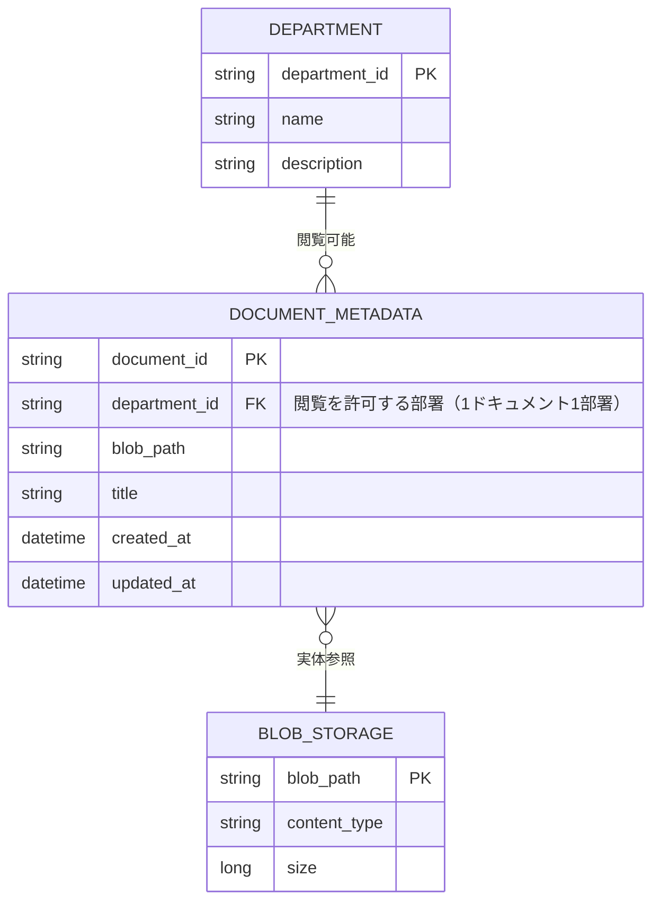

# ER図: RAG アプリケーション データモデル

唯一の正本。データベースの物理/論理テーブルおよびエンティティのみを対象とする。

## エンティティとリレーション

## 認可（Authorization）

### 概念

- **どの部署（Department）がどのドキュメントを閲覧可能か** を、`DOCUMENT_METADATA.department_id` で表現する。
- 1ドキュメントは1部署に紐づく（多対多が必要な場合は中間テーブルで拡張すること）。

### 検索時のフィルタリングとアプリ側ロジック

- **検索時**: Vertex AI Search 等で検索する際、**ログインユーザの所属部署（department_id）** をコンテキストに渡し、アプリケーション層で `DOCUMENT_METADATA.department_id = ユーザの所属部署` となるメタデータのみを対象に検索する（または Search API のフィルタ条件に `department_id` を指定する）。
- **アプリ側の責務**:
  - ユーザ認証から「所属部署」を取得する。
  - 検索クエリ実行前に、必ず `department_id` によるフィルタを付与する。
  - 一覧・ダウンロード・プレビューなど、ドキュメントにアクセスする全てのAPIで、同一の認可ルール（当該部署に紐づくドキュメントのみ）を適用する。
- **データ層**: `DOCUMENT_METADATA.department_id` は「このドキュメントを閲覧可能な部署」のキーとして保持し、インデックス・フィルタ可能にしておく。

### まとめ

| 項目 | 内容 |
|------|------|
| 認可の表現 | `DOCUMENT_METADATA.department_id` ↔ `DEPARTMENT.department_id` |
| 検索時の制御 | クエリ/フィルタに `department_id` を付与し、所属部署のドキュメントのみ取得 |
| アプリ連動 | 認証結果の所属部署を全検索・一覧・取得APIに渡し、一貫してフィルタ適用 |
