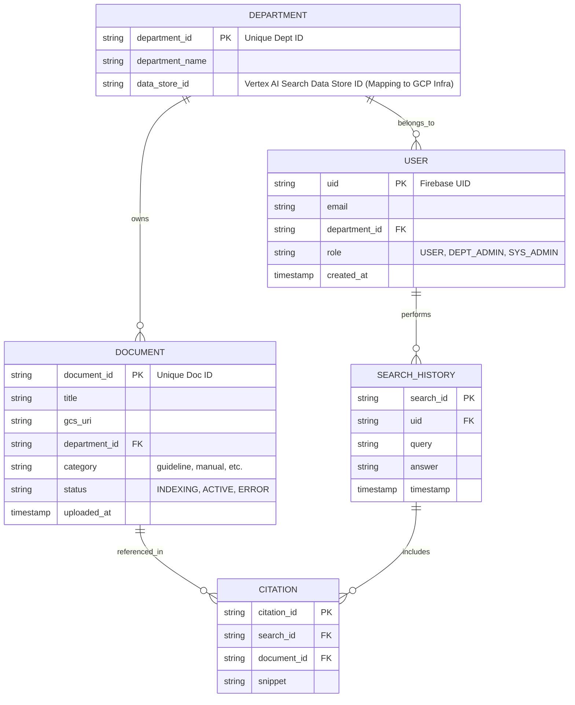

# ER図：RAG Application Data Model

## 用語定義
- **PSC**: Private Service Connect。

## ER図 (Mermaid)

## 補足事項
- **`data_store_id` について**: `DEPARTMENT` テーブルに保持している `data_store_id` は、部署ごとの Vertex AI Search リソース（データストア）を特定するためのインフラ連携用 ID です。
- **インフラ分離**: 物理的なリソース配置（VPC SC / PSC）と、論理的なデータ分離（Firestore / Vertex AI Search Data Store）の紐付けに利用されます。詳細なマッピング方針はフロー図を参照してください。
