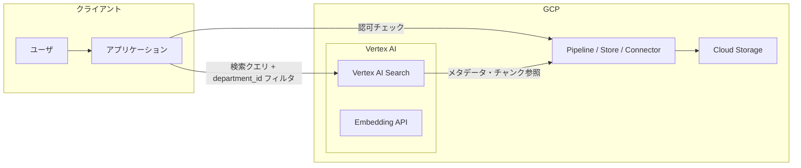

# システム構成図: Vertex AI PSC RAG

**唯一の正本**。PSC 構成に基づく RAG のフロー・構成管理図。インフラ構成・通信フローはこのドキュメントに記述し、ER図（データ構造）とは厳格に分離する。

## 構成図（Mermaid）

## フロー概要

- **ユーザ** → **アプリ**: クエリと認証情報（所属部署）。
- **アプリ** → **Vertex AI Search**: 検索リクエストに `department_id` をフィルタとして付与（ER図の認可と連動）。
- **アプリ** ↔ **PSC**: ドキュメントの実体・パイプライン制御。認可はアプリ側で一貫して適用。
- **PSC** ↔ **GCS**: ストアされたドキュメント・チャンク。

## 運用方針

- フロー図（システム構成図）は本ファイルのみを正本とする。v1/v2 や別名のフロー図は `old_versions/` に隔離し、本構成に統一する。
