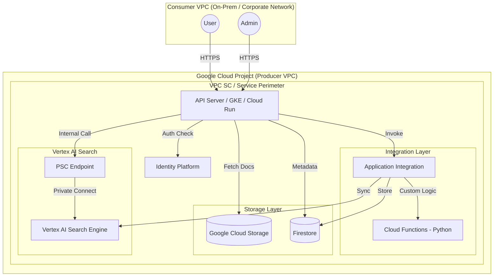

# フロー図：Vertex AI PSC RAG システム構成

## 用語定義
- **PSC**: Private Service Connect。Google Cloud のサービスを VPC 内部からプライベートに利用するためのネットワーク技術。

## 構成図 (Mermaid)

## インフラ・データマッピング方針
1.  **認可の強制点**: API サーバーが、Firestore から取得したユーザーの `department_id` に基づいて、リクエスト先の `data_store_id` を確定します。
2.  **PSC エンドポイント**: 各 Vertex AI Search のデータストア（部署単位、または共通）へのアクセスは、一元化された PSC エンドポイントを介して行われます。
3.  **VPC SC**: 全リソースをサービス境界内に配置し、インターネットへのデータ持ち出しを防止します。
