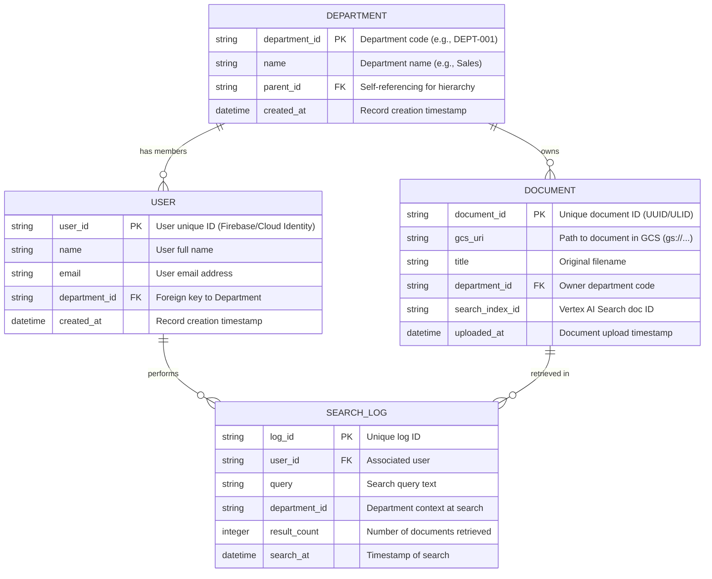

# ER図：RAG アプリケーション データモデル

## 実装・QA遵守規則
1.  **認可の強制**: アプリケーション層のAPIエンドポイントは、常にリクエスト者の `user.department_id` を取得し、DBおよびVertex AI Searchのクエリに `filter="department_id: (DEPT-001)"` 等のフィルタを**必ず**含めること。
2.  **IDの正規化**: `department_id` は全て大文字、ハイフン、数字のみを許可し、記号混入によるインジェクションを防止する。
3.  **データ整合性**: `DOCUMENT` の削除時は、Vertex AI Search のインデックスも削除することを保証し、不整合（ゴミデータ）を QA のテスト対象とする。
