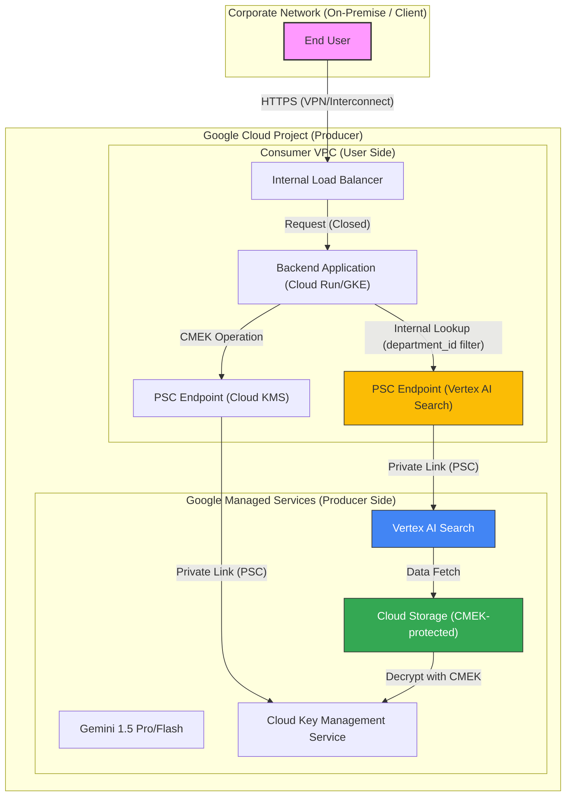

# システム構成・フロー図：Vertex AI Search (PSC Edition) RAG

## アーキテクチャ遵守規則
1.  **PSC 構成の強制**: バックエンドサービス（Cloud Run 等）は、直接インターネットへ抜けず、必ず `Service Directory` に登録された PSC エンドポイントを通じて Vertex AI API を叩くこと。
2.  **VPC Service Controls (VPC SC)**: 境界防御を有効にし、指定した PSC エンドポイント以外からの API アクセスを拒絶する。
3.  **CMEK 権限の分離**: サービスエージェント（Vertex AI / GCS / BigQuery 等）に対し、KMS の `roles/cloudkms.cryptoKeyEncrypterDecrypter` を付与し、かつ他のリソースへのアクセスを禁止する。

## 用語
- **PSC**: Private Service Connect（Google Cloud の閉域接続機構）

## テスト項目（QA合格基準）
- **通信遮断テスト**: インターネットゲートウェイおよび外部 IP を持たない環境で、正常に Vertex AI Search からの回答が得られること。
- **認可境界テスト**: `department_id: A` のユーザーが、`department_id: B` のドキュメントを取得できないことが、ログおよびレスポンスで証明されること。
- **CMEK 暗号化確認**: キーを無効化した際、即座に検索および GCS へのアクセスが失敗すること。
