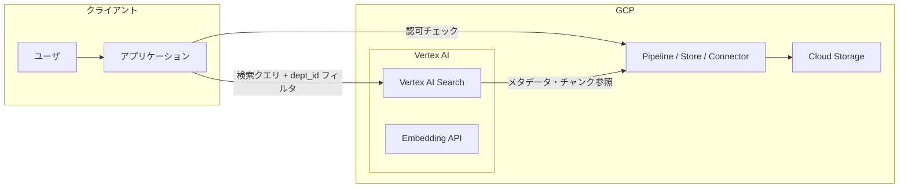

# システム構成図: Vertex AI PSC RAG

## 用語定義
- **PSC**: Private Service Connect

## 構成図（Mermaid）

## フロー概要
- 全ての通信は PSC エンドポイントを経由し、VPC Service Controls によって境界外へのデータ流出を防御する。
- 認可（部署境界）はアプリケーション側のバックエンドで強制され、ユーザーが指定した `department_id` をそのまま信用しない。
