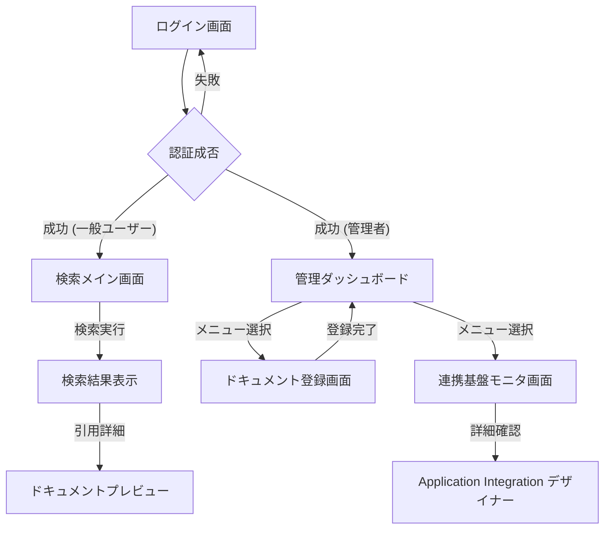

# 画面遷移図：Vertex AI PSC RAG

## 画面一覧
1. **ログイン画面**: Google Identity Platform を利用。
2. **検索メイン画面**: チャット形式の RAG インターフェース。
3. **管理ダッシュボード**: 統計情報と各機能へのリンク。
4. **ドキュメント登録画面**: ファイルアップロードとメタデータ設定。
5. **連携基盤モニタ画面**: Application Integration の実行履歴。
